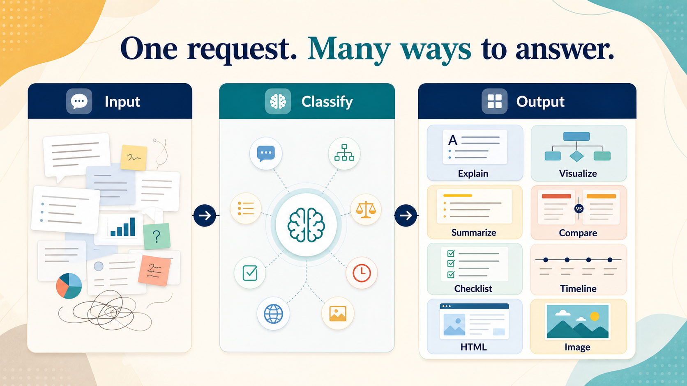

# Response Shaper Skill

Installable Codex skill package for turning dense answers into the clearest presentation mode.



## What it does

This skill classifies a request or answer and then reshapes it into the most useful form. It does not just paraphrase text. It picks the output shape that makes the answer easiest to use.

- `explain` for understanding and cause/effect
- `visualize` for flow, hierarchy, and relationships
- `summarize_actions` for what changed or what was done
- `compare` for trade-offs and options
- `checklist` for next steps and verification
- `timeline` for phases and chronology
- `html` for a shareable visual brief
- `image` for a single generated visual or infographic

When nothing is explicit, it falls back to a concise structured brief:

1. Takeaway
2. Why it matters
3. Key points
4. Next step
5. Risks or open questions

## Brand mark


The icon is designed to stay readable at small sizes. It combines a speech bubble, stacked response cards, and branching arrows to suggest "take messy input, return a clearer shape."

## How it decides

| User intent | Mode | Typical output |
| --- | --- | --- |
| "Explain this" | `explain` | concise explanation with key points |
| "Show me the structure" | `visualize` | flow, diagram, or hierarchy |
| "What did you do?" | `summarize_actions` | transformation summary |
| "Which is better?" | `compare` | trade-off view |
| "What should I do next?" | `checklist` | actionable checklist |
| "How did this happen?" | `timeline` | ordered sequence |
| "Make it a page" | `html` | readable HTML brief |
| "Make it visual" | `image` | single infographic or visual summary |

## Example usage

Use the skill when the raw answer would be hard to scan in plain Markdown:

```text
Use $response-shaper to turn this dense update into a clean visual brief.
Use $response-shaper to explain this concept as a checklist.
Use $response-shaper to summarize what changed and what happens next.
```

## Install

### From git

```bash
git clone <repo-url>
cd response-shaper-skill
npm install
npm run install:skill
```

### From a git URL with npm

```bash
npm install git+https://github.com/<owner>/response-shaper-skill.git
npx response-shaper-install
```

### From npm

After publishing the package:

```bash
npm install response-shaper-skill
npx response-shaper-install
```

## Where it installs

By default, the installer copies the skill into:

`$CODEX_HOME/skills/response-shaper`

If `CODEX_HOME` is unset, it falls back to `~/.codex/skills/response-shaper`.

## Package contents

- `skill/SKILL.md`
- `skill/agents/openai.yaml`
- `skill/references/classification.md`
- `skill/assets/response-shaper-icon.png`
- `skill/assets/response-shaper-hero.png`
- `scripts/install-skill.js`

## Notes

- The deployable skill stays clean and uses `SKILL.md` as the trigger file.
- `README.md` is for humans and distribution; Codex does not read it as part of the skill trigger.
